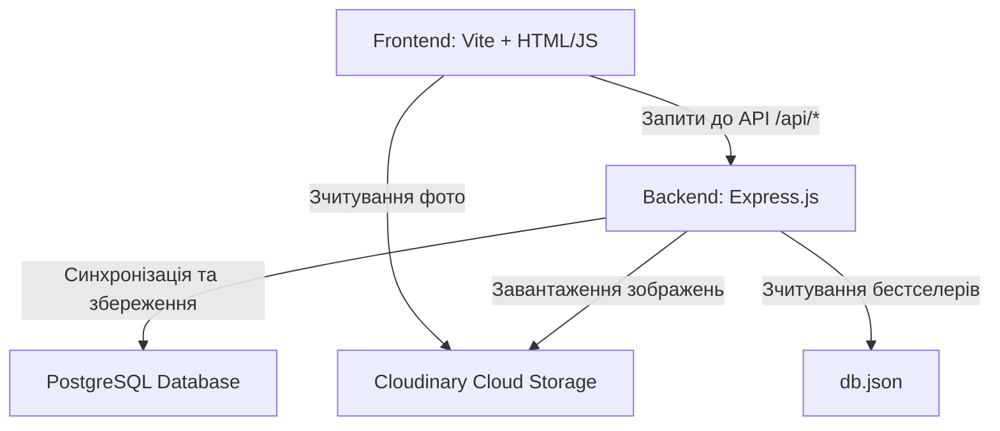

# Flora — Full-Stack проєкт доставки квітів

Flora — це full-stack веб-застосунок для перегляду та замовлення квітів. Проєкт реалізовано у форматі монорепозиторію, де клієнтська частина (фронтенд) розміщена у корені проєкту, а серверна частина (бекенд) — у підпапці backend/.

## Посилання на розгорнутий проєкт

- **Сайт (GitHub Pages):** https://saltykov-neovwrsity.github.io/umt_flora_final_saltykov/
- **Документація API (Swagger UI):** https://flora-backend-ordu.onrender.com/api-docs/
- **Репозиторій GitHub:** https://github.com/saltykov-neovwrsity/umt_flora_final_saltykov


---

## Структура проєкту та архітектурні зв'язки

Проєкт складається з трьох основних компонентів, що взаємодіють між собою:



### 1. Клієнтська частина (Фронтенд) — у корені проєкту
- Стек: HTML5 (семантична розмітка), CSS3 (адаптивна верстка на CSS Grid), Vanilla Javascript (ES Modules), Vite (збирач проєкту).
- Логіка роботи: Завантажує каталог букетів та відгуки через клієнт apiClient (Axios).
- Зв'язок з бекендом: 
  - Локально: Запити проксуються через конфігурацію vite.config.js з порту 4000 на port 3001 бекенду (правила проксі для /api та /photos).
  - У продакшені: Направляє запити безпосередньо на публічну адресу бекенду на Render (через змінну VITE_API_BASE_URL у секретах GitHub Actions).

### 2. Серверна частина (Бекенд) — папка /backend
- Стек: Node.js, Express.js (веб-сервер), Sequelize ORM (робота з БД), Joi (валідація), Multer (завантаження файлів), Swagger (документація).
- Логіка роботи: Надає REST API для роботи з колекцією букетів та коментарів (зберігаються у базі даних PostgreSQL) та бестселерів (зчитуються з файлу db.json).
- Зв'язок з базою даних: Підключений до хмарної бази даних PostgreSQL на Render. Локально (за відсутності ключів підключення) автоматично перемикається на вбудовану базу даних SQLite (dev.sqlite).

### 3. Хмарне сховище зображень (Cloudinary)
- Завантажені користувачем фотографії букетів не зберігаються на сервері Render (оскільки його файлова система є тимчасовою).
- Сервер через Multer приймає фото у буферну папку temp/, відправляє у хмару Cloudinary, видаляє локальний файл, а в базу PostgreSQL записує лише отримане захищене посилання (photoURL).

---

## Детальний опис папок проєкту

```text
flora/ (Коренева папка фронтенду)
├── .github/workflows/   # Автоматичний деплой на GitHub Pages
├── backend/             # Серверна частина Express.js (див. README всередині)
├── docs/                # Документація стану та дизайну проєкту
├── icons/               # SVG-іконки проєкту
├── images/              # Статичні зображення фронтенду (зокрема, бестселери)
├── js/                  # Логіка фронтенду (apiClient, bouquets, слайдери)
├── styles/              # CSS-стилі (скидання, кольори, адаптивна сітка)
├── .env.example         # Приклад змінних для Vite
├── db.json              # Початкова база даних (використовується для сідингу)
├── index.html           # Головна сторінка сайту
└── vite.config.js       # Конфігурація збірки та дев-проксі
```

---

## Як запустити проєкт локально

Для запуску full-stack застосунку локально вам потрібно відкрити два термінали:

### Термінал 1: Сервер (Бекенд)
```bash
cd backend
npm install
npm run dev
```
Детальні налаштування .env для підключення до бази та Cloudinary описані в README бекенду.

### Термінал 2: Клієнт (Фронтенд)
```bash
npm install
npm run dev
```
Фронтенд запуститься за адресою http://localhost:4000.

---

## Інтерактивна документація (Swagger UI)
При запущеному сервері перейдіть за адресою:
- Локально: http://localhost:3001/api-docs
- Продакшен: https://flora-backend-ordu.onrender.com/api-docs

Тут можна протестувати всі API запити (створення букетів, зміна статусу favorite, видалення, завантаження фото) безпосередньо з браузера.
